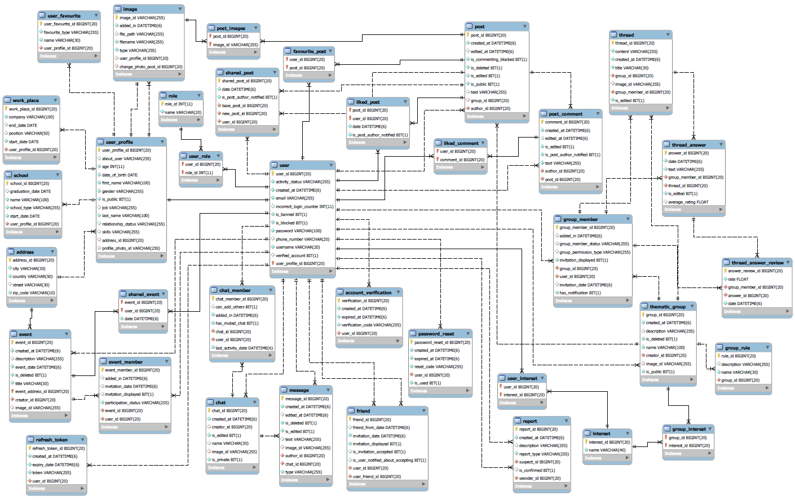

# Social Network - REST API
Server for the social network application.  
*It was made as part of an engineering thesis.*

## Frontend
Web application using server API:  
[https://github.com/SzymonT99/social-network-app.git](https://github.com/SzymonT99/social-network-app.git)

## Technologies
- Java 8
- Spring Boot 2.5
- Spring Data JPA
- Spring Security
- JWT
- JUnit
- Mockito
- MySQL

## Swagger Documentation
[https://app.swaggerhub.com/apis/SzymonT99/social-network_api/1.0](https://app.swaggerhub.com/apis/SzymonT99/social-network_api/1.0)

## Setup
To run the server you must:
1. Clone the server repository:  
   [https://github.com/SzymonT99/social-network-server.git](https://github.com/SzymonT99/social-network-server.git)
2. Launch XAMPP Control Panel.
3. Run Spring Boot in IDE or execute commands:
    * `mvn dependency:resolve`
    * `mvn install`
    * `mvn spring-boot:run`

## Database
The MySQL relational database was used.
 
- ERD diagram
  
  